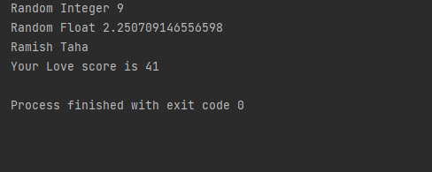
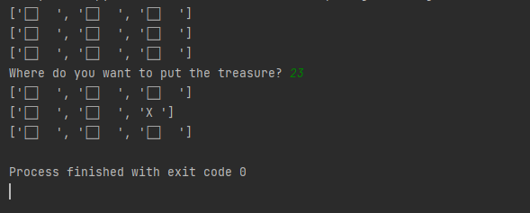
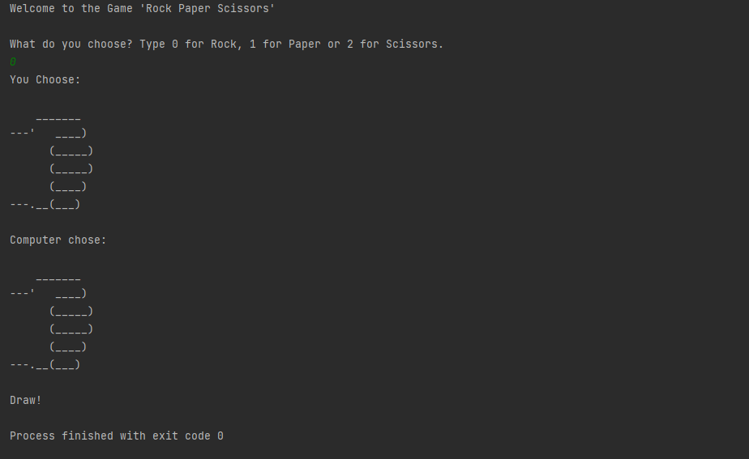

# Working with Modules and The Random Module

## This Project Consists of 3 Programs

### 1. Custom Module:- In this program I made my own Custom Module called my_module.py and imported and used it in my program.

### 2. Treasure Map:- In this program User Enters the Coordinates of the place where user wants to place the treasure, and the Treasure is placed there.

### 3. Rock Paper Scissors:- The Classic game Recreated on python.

## What I learned doing this project.
1. Importing modules
2. Creating custom modules
3. The Random module
4. 2-dimensional list
